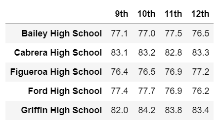
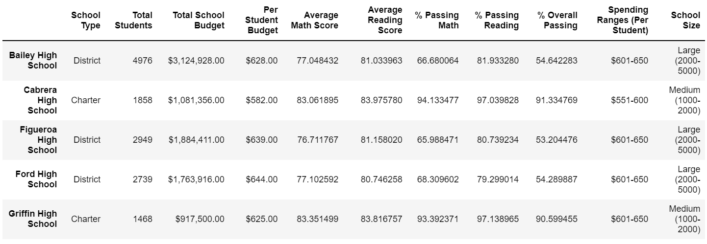

# School_District_Analysis

## Overview
The analysis of the school district: 

    - Top 5 and bottom 5 performing schools, based on the overall passing rate
    - The average math score received by students in each grade level at each school
    - The average reading score received by students in each grade level at each school
    - School performance based on the budget per student
    - School performance based on the school size 
    - School performance based on the type of school

## Result

### Top 5 perfoming schools
  

### bottom 5 perfoming schools
  

### average math grade by grade
  

### average reading grade by grade
  

### School performance based on the budget per student & Summary
  
#####    Summary
  

### School performance based on School size
  
#####    Summary
  

### School performance based on School type
  

## Summary

By replacing the ninth grader scores with NaN for Thomas High School, the overall passing percentages and averge scores increased. Through this practice, we can see how the analysis will change based on the data set sellection. It is important to understand how including and excluding the data will change the result and seeking for best suitable solutions. 